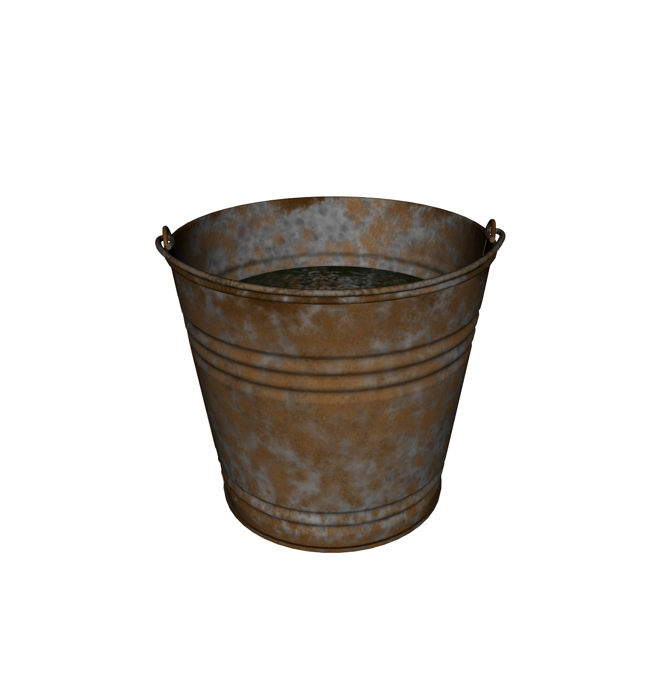

# Rustybucket

Is a take on porting some python pandas into rust for performance improvements over versions and why they happen

## benchmarks
use of https://github.com/bheisler/criterion.rs

### aggregations
Initially aggregation was the main goal to benchmark but that is a one time pass through a Vec<T> which is not that interesting and will be fast by default.
Such functions such as:
- sum
- mean
- groupBy

Are excluding from benchmark tests for now.

### slicing and concatination

TODO for improvements:
create a view struct on top of the series
- creates a read-only view of the slice of the data to be used for aggregation
- implements the same traits as the series struct
- once the view needs to be copied we just clone the view slice

### series implementation vec vs slice
A vector **owns** its elements. That means the vector is responsible for allocating and freeing the elements it points to. The lifetime of the vector's elements is the same as the lifetime of the vector itself, so there's no need to specify a lifetime to the Vec type.

A slice **borrows** the elements of a vector or array that may be allocated statically or dynamically. The slice must indicate the lifetime of the borrowed elements so that the compiler can make the necessary safety checks.

> What is the design reason for Vec not implementing the Iterator trait?

The rust compiler does not whic of the three iterators should it implement? There are three different kinds of iterator you can get from a Vec:

vec.iter() gives Iterator<Item = &T>,
vec.iter_mut() gives Iterator<Item = &mut T> and modifies the vector
vec.into_iter() gives Iterator<Item = T> and consumes the vector in the process.

## the story of the rustybucket
Yo, listen up, I got a story to tell

'Bout a bucket that collected things so well

Started off shiny, new and clean

But soon enough, it got old and mean

Got rusty, crusty, covered in grime

It wasn't worth a single dime

Shake that bucket, shake it fast

Collecting dust, it won't last

Shake that bucket, shake it clean

Or else it'll turn into a rusty machine
